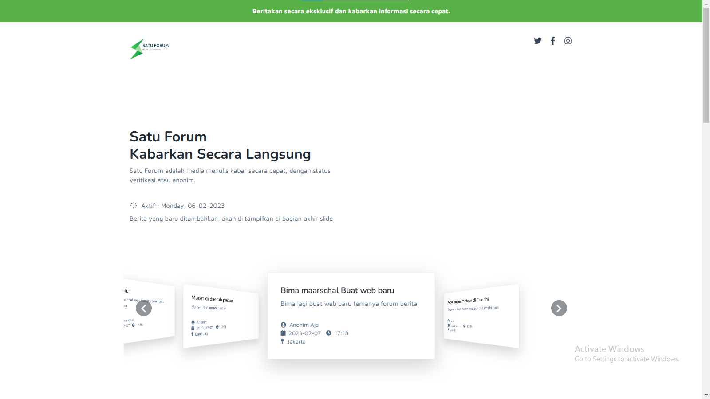
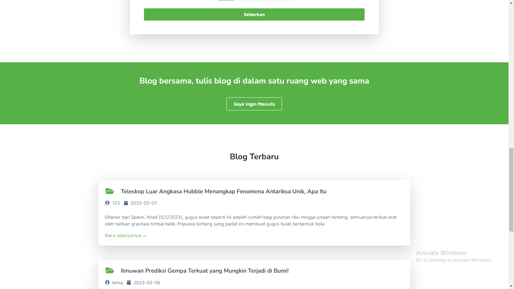
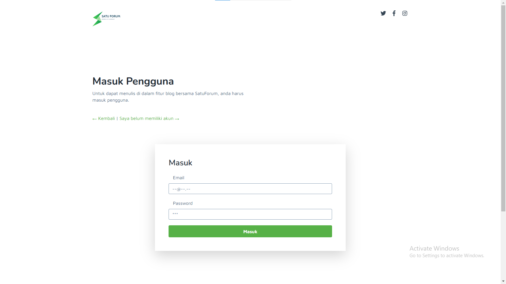
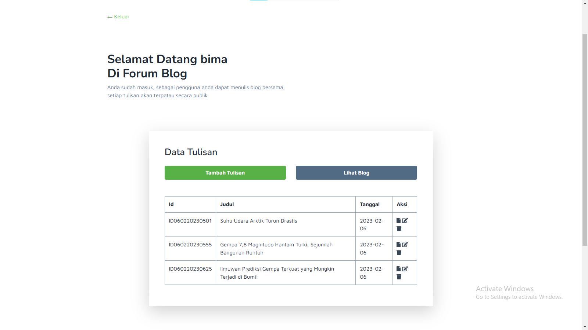

# SatuForum

------

# Bimamaarschal

<p align="center">
  
  <p align="center">
    <strong>Semua Kode terdukumentasi di <a href="https://github.com/Bimamaarschal/SatuForum">https://github.com/Bimamaarschal/SatuForum</a></strong>.
  </p>
</p>

**PHP Insights** Satu Forum adalah aplikasi berbasis Website PHP, yang berfungsi sebagai media menulis kabar secara cepat, dengan status verifikasi atau anonim. Adapun fitur lain yaitu Blog, blog adalah fitur menulis informasi, penulis pada fitur blog harus mendaftar dan masuk untuk dapat memulai menulis.

## 🚀 cara Menjalankan Satu Forum

```
# Pull Projek dari Github 
https://github.com/Bimamaarschal/SatuForum

# Aktifkan XAMPP
Aktifkan beberapa fungsi panel XAMPP

# Import Data Base - SQL
Database sql
- Nama database yaitu satu forum
- Buat database dengan nama satu forum
- Import satuforum.sql | file SQL berada pada folder /database
- Jika berhasil sudah tersedia beberapa data contoh

# Pindahkan file ke htdocs XAMPP:
Jalankan file index.php dengan sistem server localhost

```

## ✨ Berjalan
-- **PHP** versi 8.2.0
-- **PHPMyAdmin** versi 5.2.0
-- **Server** MariaDB
-- **SQLI**

## ✨ Fitur


- Satu Forum **Forum Cepat** dan **Blog Bersama**


- Forum cepat adalah forum informasi yang memungkinkan pengguna langsung dapat menambahkan informasi ke **SatuForum**



- Daftar akun/ Masuk akun/ edit Blog/ hapus Blog (CRUD)



- Simple sistem
- Responsive desain


## 💖 pembuat
**Semua kode pada aplikasi Website Satu Forum di buat oleh Bima Maarschal**
Klik bintang

Hubungi bimamaarschal@gmail.com untuk informasi yang dibutuhkan.
Terima kasih.
